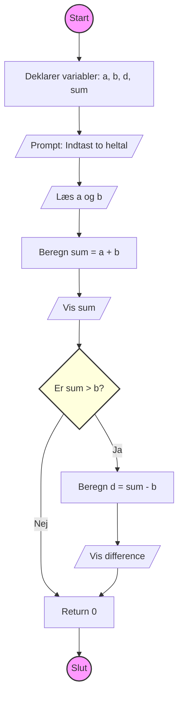

```mermaid
flowchart TD
    Start((Start)) --> Init[Deklarer variabler: a, b, d, sum]
    Init --> Input1[/Prompt: Indtast to heltal/]
    Input1 --> Input2[/Læs a og b/]
    Input2 --> Process1[Beregn sum = a + b]
    Process1 --> Output1[/Vis sum/]
    Output1 --> Decision{Er sum > b?}
    Decision -->|Ja| Process2[Beregn d = sum - b]
    Process2 --> Output2[/Vis difference/]
    Decision -->|Nej| Return[Return 0]
    Output2 --> Return
    Return --> End((Slut))

    style Start fill:#f9f,stroke:#333,stroke-width:2px
    style End fill:#f9f,stroke:#333,stroke-width:2px
    style Decision fill:#ffd,stroke:#333,stroke-width:2px
```
