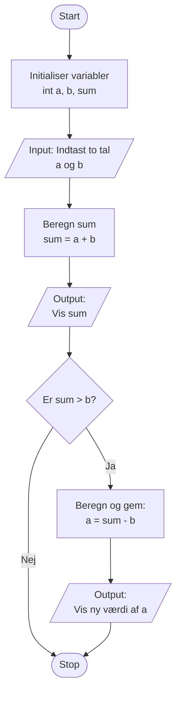

```mermaid
flowchart TD
    Start([Start]) --> Init["Initialiser variabler
    int a, b, sum"]
    Init --> Input[/"Input: Indtast to tal
    a og b"/]
    Input --> Sum["Beregn sum
    sum = a + b"]
    Sum --> PrintSum[/"Output: 
    Vis sum"/]
    PrintSum --> Condition{"Er sum > b?"}
    Condition -->|Ja| Calc["Beregn og gem:
    a = sum - b"]
    Condition -->|Nej| End
    Calc --> PrintA[/"Output:
    Vis ny værdi af a"/]
    PrintA --> End([Stop])
```
