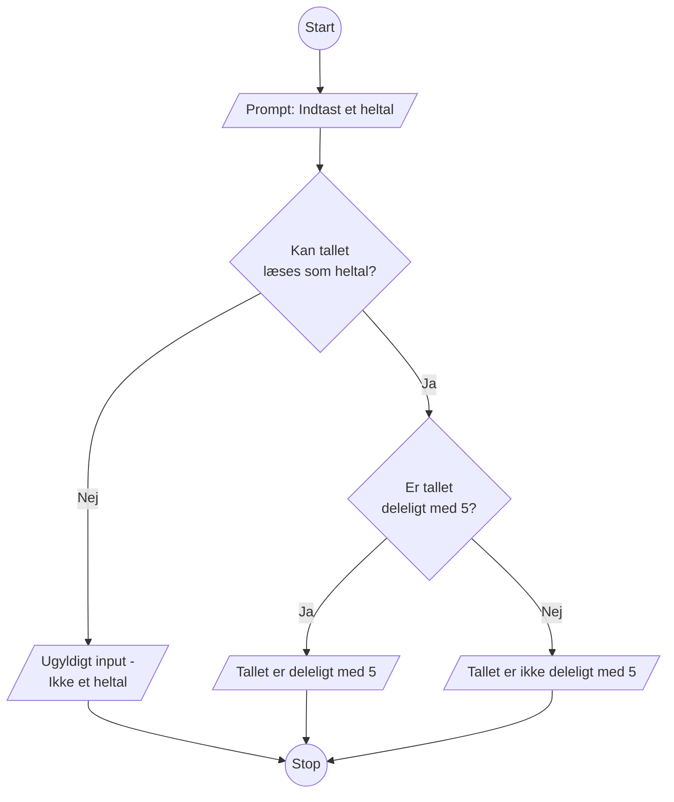

```mermaid
flowchart TD
    Start((Start))
    Input[/Prompt: Indtast et heltal/]
    Check1{Kan tallet\nlæses som heltal?}
    Check2{Er tallet\ndeleligt med 5?}
    Out1[/Tallet er deleligt med 5/]
    Out2[/Tallet er ikke deleligt med 5/]
    Err[/Ugyldigt input -\nIkke et heltal/]
    End((Stop))

    Start --> Input
    Input --> Check1
    Check1 -->|Ja| Check2
    Check1 -->|Nej| Err
    Check2 -->|Ja| Out1
    Check2 -->|Nej| Out2
    Err --> End
    Out1 --> End
    Out2 --> End
```
