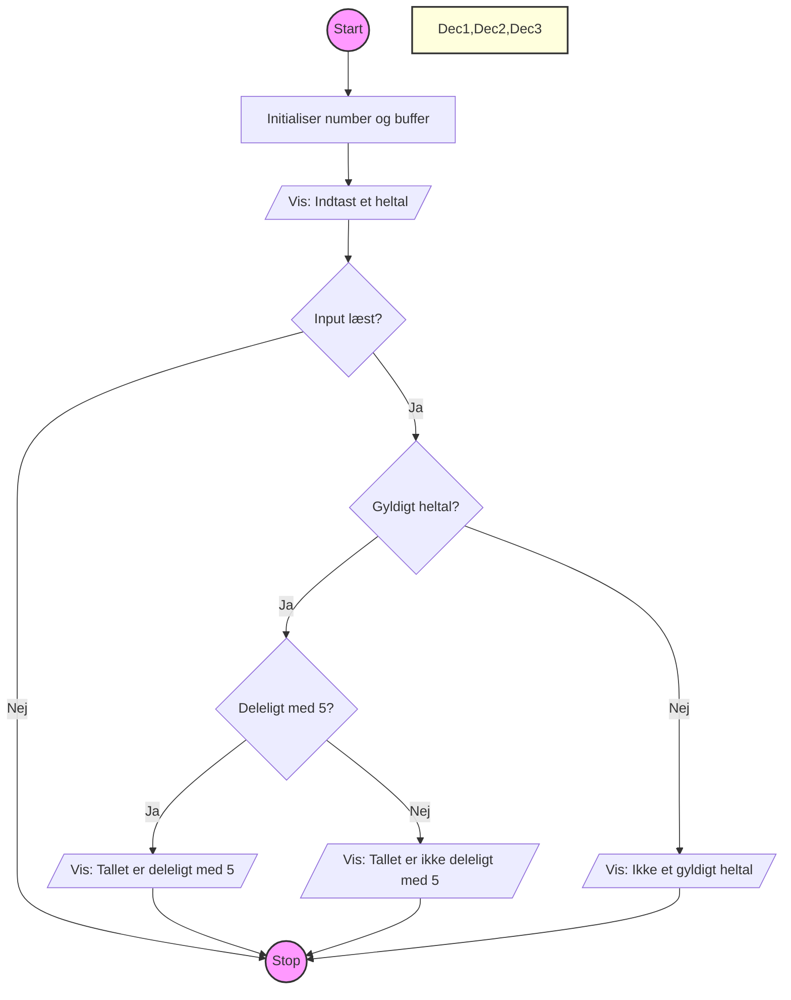

```mermaid
flowchart TD
    Start((Start))
    Init[Initialiser number og buffer]
    Input[/Vis: Indtast et heltal/]
    Dec1{Input læst?}
    Dec2{Gyldigt heltal?}
    Dec3{Deleligt med 5?}
    Out1[/Vis: Tallet er deleligt med 5/]
    Out2[/Vis: Tallet er ikke deleligt med 5/]
    Err[/Vis: Ikke et gyldigt heltal/]
    End((Stop))

    Start --> Init
    Init --> Input
    Input --> Dec1
    Dec1 -->|Ja| Dec2
    Dec1 -->|Nej| End
    Dec2 -->|Ja| Dec3
    Dec2 -->|Nej| Err
    Dec3 -->|Ja| Out1
    Dec3 -->|Nej| Out2
    Out1 --> End
    Out2 --> End
    Err --> End

    style Start fill:#f9f,stroke:#333,stroke-width:2px
    style End fill:#f9f,stroke:#333,stroke-width:2px
    style Dec1,Dec2,Dec3 fill:#ffd,stroke:#333,stroke-width:2px
```
