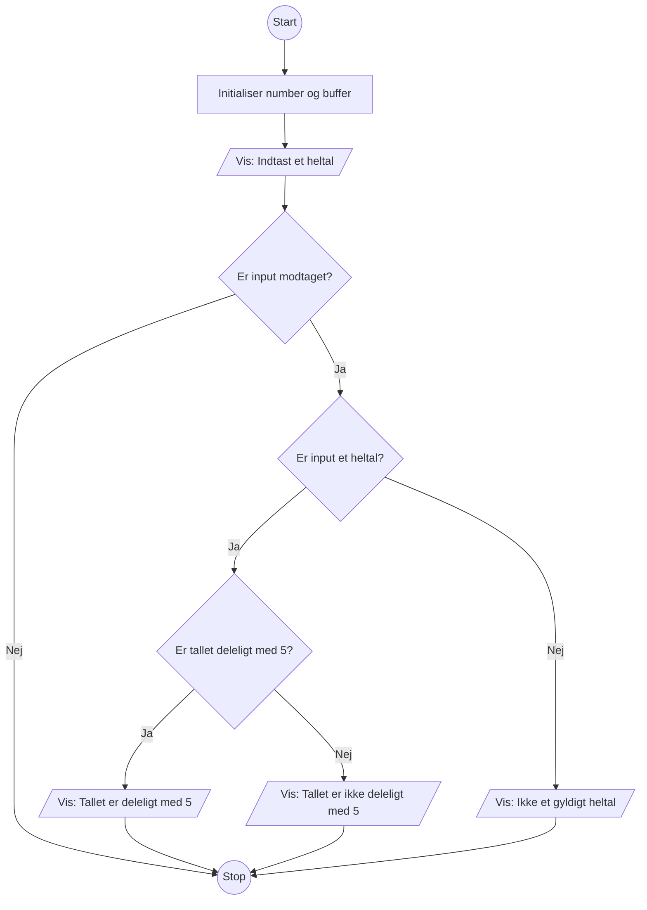

```mermaid
flowchart TD
    Start((Start))
    Init[Initialiser number og buffer]
    Input[/Vis: Indtast et heltal/]
    Check1{Er input modtaget?}
    Check2{Er input et heltal?}
    Check3{Er tallet deleligt med 5?}
    Out1[/Vis: Tallet er deleligt med 5/]
    Out2[/Vis: Tallet er ikke deleligt med 5/]
    Err[/Vis: Ikke et gyldigt heltal/]
    End((Stop))

    Start --> Init
    Init --> Input
    Input --> Check1
    Check1 -->|Ja| Check2
    Check1 -->|Nej| End
    Check2 -->|Ja| Check3
    Check2 -->|Nej| Err
    Check3 -->|Ja| Out1
    Check3 -->|Nej| Out2
    Out1 --> End
    Out2 --> End
    Err --> End
```
