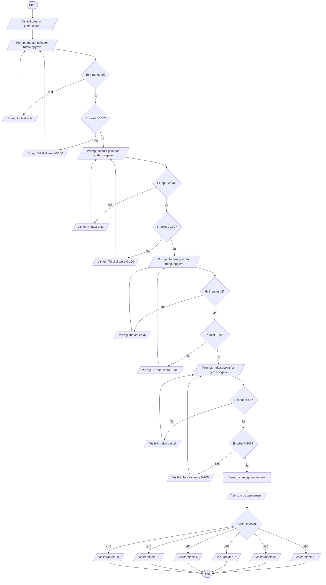

```mermaid
flowchart TD
    Start([Start]) --> Welcome[/"Vis velkomst og instruktioner"/]
    Welcome --> Input1[/"Prompt: Indtast point for første opgave"/]
    
    Input1 --> Valid1{Er input et tal?}
    Valid1 -->|Nej| Error1[/"Vis fejl: Indtast et tal"/] --> Input1
    Valid1 -->|Ja| Range1{Er tallet 0-100?}
    Range1 -->|Nej| Error2[/"Vis fejl: Tal skal være 0-100"/] --> Input1
    Range1 -->|Ja| Input2[/"Prompt: Indtast point for anden opgave"/]
    
    Input2 --> Valid2{Er input et tal?}
    Valid2 -->|Nej| Error3[/"Vis fejl: Indtast et tal"/] --> Input2
    Valid2 -->|Ja| Range2{Er tallet 0-100?}
    Range2 -->|Nej| Error4[/"Vis fejl: Tal skal være 0-100"/] --> Input2
    Range2 -->|Ja| Input3[/"Prompt: Indtast point for tredje opgave"/]
    
    Input3 --> Valid3{Er input et tal?}
    Valid3 -->|Nej| Error5[/"Vis fejl: Indtast et tal"/] --> Input3
    Valid3 -->|Ja| Range3{Er tallet 0-100?}
    Range3 -->|Nej| Error6[/"Vis fejl: Tal skal være 0-100"/] --> Input3
    Range3 -->|Ja| Input4[/"Prompt: Indtast point for fjerde opgave"/]
    
    Input4 --> Valid4{Er input et tal?}
    Valid4 -->|Nej| Error7[/"Vis fejl: Indtast et tal"/] --> Input4
    Valid4 -->|Ja| Range4{Er tallet 0-100?}
    Range4 -->|Nej| Error8[/"Vis fejl: Tal skal være 0-100"/] --> Input4
    
    Range4 -->|Ja| Calc[Beregn sum og gennemsnit]
    Calc --> ShowResults[/"Vis sum og gennemsnit"/]
    
    ShowResults --> Grade{Hvilket interval?}
    Grade -->|≥90| Grade12[/"Vis karakter: 12"/]
    Grade -->|≥80| Grade10[/"Vis karakter: 10"/]
    Grade -->|≥70| Grade7[/"Vis karakter: 7"/]
    Grade -->|≥60| Grade4[/"Vis karakter: 4"/]
    Grade -->|≥40| Grade02[/"Vis karakter: 02"/]
    Grade -->|<40| Grade00[/"Vis karakter: 00"/]
    
    Grade12 & Grade10 & Grade7 & Grade4 & Grade02 & Grade00 --> End([Slut])
```
