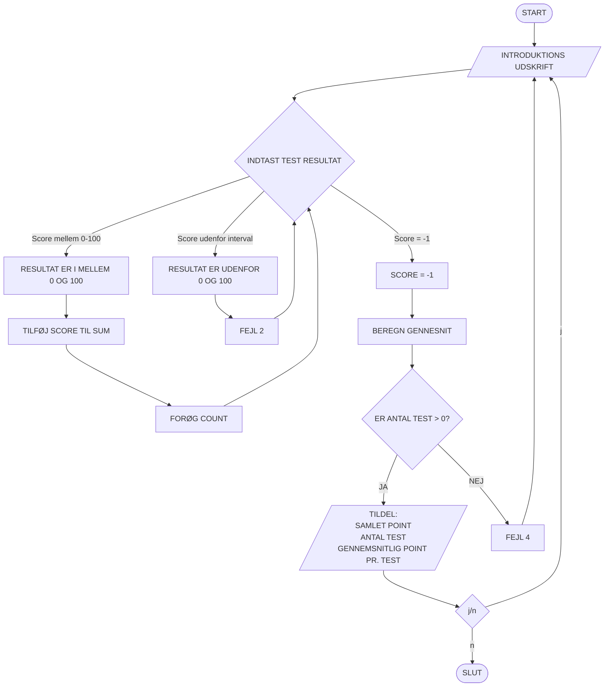

```mermaid
flowchart TD
    Start([START]) --> IntroText[/INTRODUKTIONS UDSKRIFT/]
    IntroText --> TestInput{INDTAST TEST RESULTAT}
    
    TestInput -->|Score mellem 0-100| ValidScore[RESULTAT ER I MELLEM 0 OG 100]
    ValidScore --> AddScore[TILFØJ SCORE TIL SUM]
    AddScore --> IncCount[FORØG COUNT]
    IncCount --> TestInput
    
    TestInput -->|Score udenfor interval| InvalidScore[RESULTAT ER UDENFOR 0 OG 100]
    InvalidScore --> Error2[FEJL 2]
    Error2 --> TestInput
    
    TestInput -->|Score = -1| ExitInput[SCORE = -1]
    ExitInput --> CalcAvg[BEREGN GENNESNIT]
    
    CalcAvg --> TestCount{ER ANTAL TEST > 0?}
    
    TestCount -->|JA| ShowResults[/TILDEL:\nSAMLET POINT\nANTAL TEST\nGENNEMSNITLIG POINT PR. TEST/]
    ShowResults --> Continue{j/n}
    
    Continue -->|j| IntroText
    Continue -->|n| End([SLUT])
    
    TestCount -->|NEJ| Error4[FEJL 4]
    Error4 --> IntroText
```
