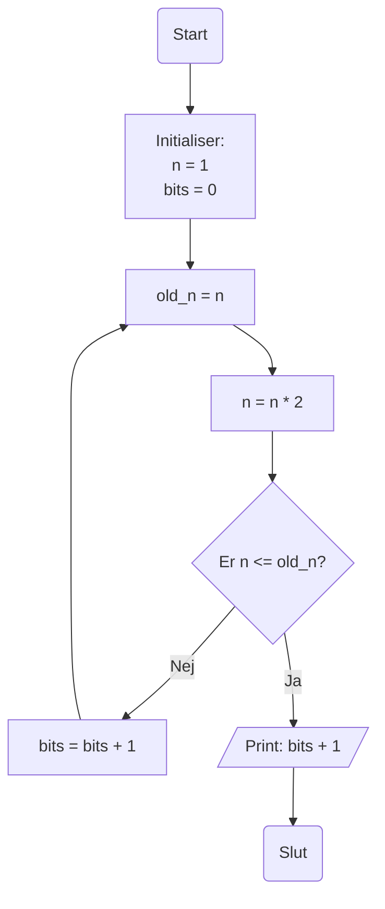

```mermaid
flowchart TD
    A(Start) --> B[Initialiser:\nn = 1\nbits = 0]
    B --> C[old_n = n]
    C --> D[n = n * 2]
    D --> E{Er n <= old_n?}
    E -->|Nej| F[bits = bits + 1] --> C
    E -->|Ja| G[/Print: bits + 1/]
    G --> H(Slut)
```
