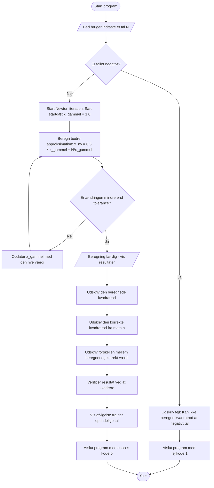

```mermaid
flowchart TB
    Start([Start program]) --> InputN[/Bed bruger indtaste et tal N/]
    InputN --> CheckNeg{Er tallet negativt?}
    CheckNeg -->|Ja| Error[Udskriv fejl: Kan ikke beregne kvadratrod af negativt tal]
    Error --> ReturnErr[Afslut program med fejlkode 1]
    ReturnErr --> End([Slut])
    
    CheckNeg -->|Nej| Init[Start Newton iteration: Sæt startgæt x_gammel = 1.0]
    Init --> CalcLoop[Beregn bedre approksimation: x_ny = 0.5 * x_gammel + N/x_gammel]
    CalcLoop --> CheckTol{Er ændringen mindre end tolerance?}
    CheckTol -->|Nej| Update[Opdater x_gammel med den nye værdi]
    Update --> CalcLoop
    
    CheckTol -->|Ja| Results[/Beregning færdig - vis resultater/]
    Results --> ShowCalc[Udskriv den beregnede kvadratrod]
    ShowCalc --> ShowReal[Udskriv den korrekte kvadratrod fra math.h]
    ShowReal --> ShowDiff[Udskriv forskellen mellem beregnet og korrekt værdi]
    ShowDiff --> ShowVerif[Verificer resultat ved at kvadrere]
    ShowVerif --> ShowDev[Vis afvigelse fra det oprindelige tal]
    ShowDev --> ReturnOk[Afslut program med succes kode 0]
    ReturnOk --> End
```
